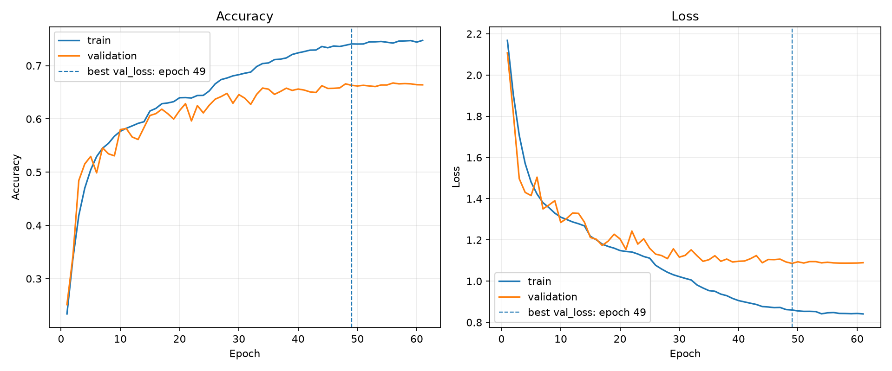
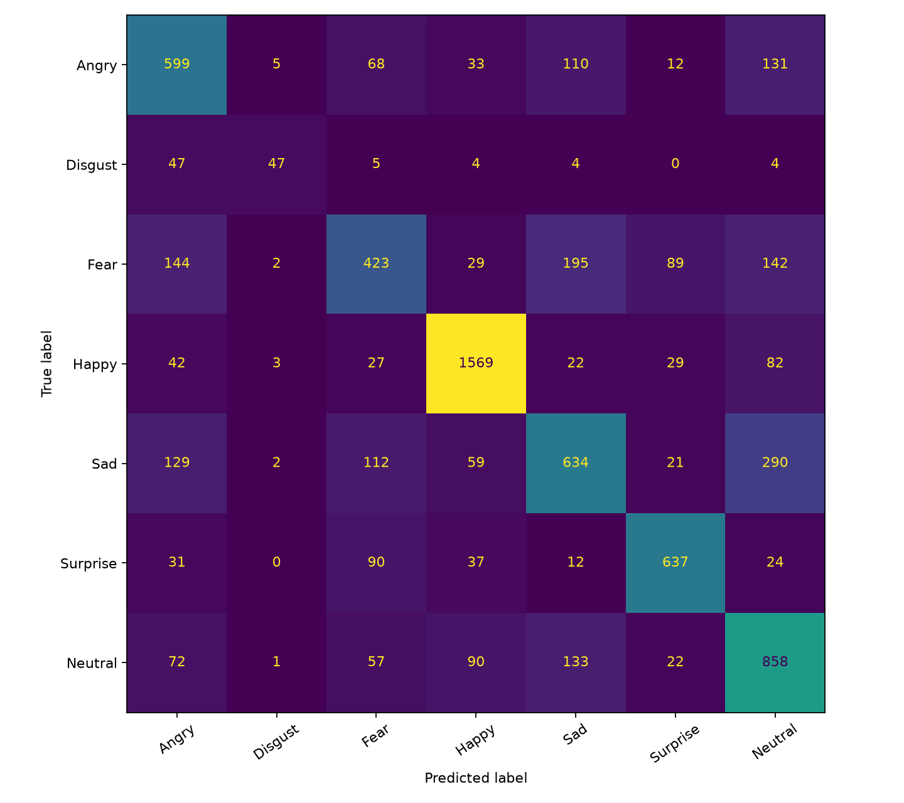
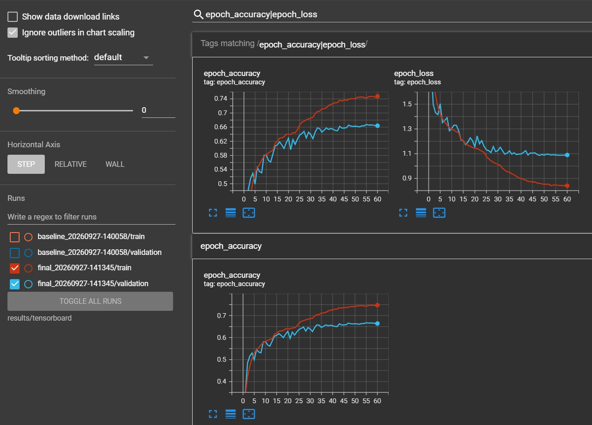
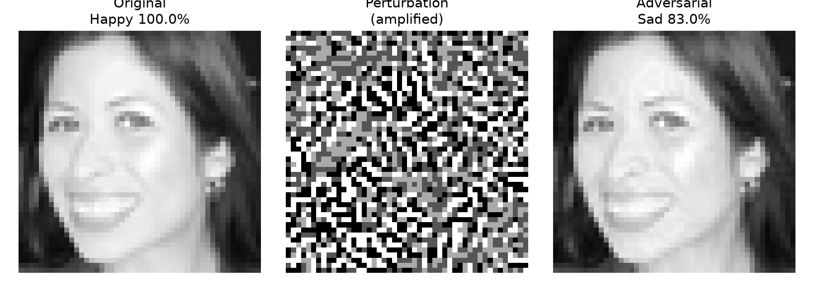

# Emotions Detector

Real-time facial emotion recognition for the 01-edu / Tomorrow School computer-vision assignment. The project trains a CNN from scratch on FER data, detects faces with OpenCV, converts them to `48×48` grayscale crops, and predicts one of seven emotions from a webcam or recorded video stream.

## 📋 TOC

- [🚀 Quick start](#-quick-start)
- [📝 About](#-about)
- [🧠 Model](#-model)
- [📊 Results](#-results)
- [📈 Training and TensorBoard](#-training-and-tensorboard)
- [🎥 Video pipeline](#-video-pipeline)
- [✨ Bonus features](#-bonus-features)
- [🧪 Verification](#-verification)
- [📁 Project structure](#-project-structure)
- [⚠️ Limitations](#️-limitations)
- [🧑‍💻 Author](#-author)

## 🚀 Quick start

### Requirements

- Python 3.12
- OpenCV
- TensorFlow / Keras
- NumPy
- pandas
- scikit-learn
- matplotlib
- TensorBoard

Clone and create the environment:

```bash
git clone https://github.com/legion2440/emotions-detector.git
cd emotions-detector

python3 -m venv .venv
source .venv/bin/activate
python -m pip install --upgrade pip
pip install -r requirements.txt
```

For NVIDIA GPU training under WSL2:

```bash
pip install "tensorflow[and-cuda]"
```

Check that TensorFlow sees the GPU:

```bash
python -c "import tensorflow as tf; print(tf.config.list_physical_devices('GPU'))"
```

The training runs used an NVIDIA GeForce RTX 4080 Laptop GPU under WSL2.

### Dataset

Download the FER dataset supplied by the assignment:

```text
https://assets.01-edu.org/ai-branch/project3/emotions-detector.zip
```

Expected files:

```text
data/train.csv
data/test.csv
data/test_with_emotions.csv
```

Train the mandatory model:

```bash
python ./scripts/train.py --profile final
```

Evaluate it:

```bash
python ./scripts/predict.py
```

Recorded result:

```text
Accuracy on test set: 66.38%
```

## 📝 About

The classifier recognizes seven FER classes:

| ID | Emotion |
|---:|---|
| 0 | Angry |
| 1 | Disgust |
| 2 | Fear |
| 3 | Happy |
| 4 | Sad |
| 5 | Surprise |
| 6 | Neutral |

The project is split into two main parts:

1. train and evaluate an emotion classifier;
2. detect faces in a video stream and classify at least one emotion per second.

The mandatory classifier is trained only from `train.csv`. The labeled test set is used only after training for final evaluation.

## 🧠 Model

### Mandatory CNN from scratch

Input:

```text
48 × 48 × 1 grayscale
```

The final model uses four convolutional blocks:

```text
64 → 128 → 256 → 256 filters
```

Each block contains convolution, Batch Normalization, ReLU, pooling and Dropout. The classifier head uses a 256-unit dense layer and a seven-class softmax output.

Training also uses:

- horizontal flip;
- small rotation, translation and zoom;
- L2 regularization;
- Dropout;
- Adam;
- `ModelCheckpoint`;
- `ReduceLROnPlateau`;
- `EarlyStopping`;
- TensorBoard.

The baseline was intentionally smaller and validated the complete training pipeline before the final architecture was selected.

### Architecture iterations

| Model | Best validation accuracy | Test accuracy |
|---|---:|---:|
| Baseline CNN | 58.07% | 54.53% |
| Final CNN from scratch | ~66–67% | **66.38%** |
| Optional ResNet50V2 transfer model | 60.25% | 60.39% |

The final from-scratch CNN is the mandatory production model.

The optional ImageNet transfer model is kept as an experiment. It works correctly but does not outperform the dedicated FER CNN on this dataset.

## 📊 Results

### Final test accuracy

```text
66.38%
```

The assignment requires more than 60%.

### Per-class report

| Emotion | Precision | Recall | F1 |
|---|---:|---:|---:|
| Angry | 0.5630 | 0.6253 | 0.5925 |
| Disgust | 0.7833 | 0.4234 | 0.5497 |
| Fear | 0.5409 | 0.4131 | 0.4684 |
| Happy | 0.8616 | 0.8844 | 0.8729 |
| Sad | 0.5712 | 0.5084 | 0.5380 |
| Surprise | 0.7864 | 0.7665 | 0.7764 |
| Neutral | 0.5604 | 0.6959 | 0.6208 |

The strongest classes are `Happy` and `Surprise`. `Fear` is the most difficult class for the final model.

### Learning curves



### Confusion matrix



Additional evaluation artifacts:

```text
results/model/classification_report.txt
results/model/confident_mistakes.png
```

## 📈 Training and TensorBoard

Training:

```bash
python ./scripts/train.py --profile final
```

The final run stopped at epoch 61 and restored the best checkpoint from epoch 49.

Generated artifacts:

```text
results/model/final_emotion_model.keras
results/model/final_emotion_model_arch.txt
results/model/training_history.json
results/model/training_runs.jsonl
results/model/learning_curves.png
```

Regenerate learning curves:

```bash
python ./scripts/validation_loss_accuracy.py
```

Start TensorBoard:

```bash
tensorboard --logdir results/tensorboard
```

Required TensorBoard evidence:

```text
results/model/tensorboard.png
```



## 🎥 Video pipeline

The runtime pipeline is:

```text
webcam / video
      ↓
OpenCV face detector
      ↓
face crop
      ↓
48×48 grayscale
      ↓
final_emotion_model.keras
      ↓
emotion + probability
```

Face detection uses OpenCV's bundled frontal-face Haar cascade through `cv2.CascadeClassifier`.

### Preprocessing audit

Webcam:

```bash
python ./scripts/preprocess.py --source 0 --preview
```

Recorded-video fallback:

```bash
python ./scripts/preprocess.py \
  --source results/preprocessing_test/input_video.mp4 \
  --preview
```

The audit output contains at least 20 face crops:

```text
results/preprocessing_test/image0.png
results/preprocessing_test/image1.png
...
results/preprocessing_test/image19.png
```

Every crop is:

- detected from the input stream;
- centered on a face;
- converted to grayscale;
- resized to exactly `48×48`.

### Live inference

Default audit command:

```bash
python ./scripts/predict_live_stream.py
```

The script first tries webcam `0`. If the webcam is unavailable and
`results/preprocessing_test/input_video.mp4` exists, it automatically switches to the recorded-video fallback.

Explicit webcam:

```bash
python ./scripts/predict_live_stream.py --source 0
```

Explicit recorded video:

```bash
python ./scripts/predict_live_stream.py \
  --source results/preprocessing_test/input_video.mp4
```

Terminal output is emitted at least once per second:

```text
Reading video stream ...

Preprocessing ...
15:19:34s : Happy , 99%

Preprocessing ...
15:20:40s : Angry , 88%

Preprocessing ...
15:20:50s : Happy , 68%
```

The live overlay also supports:

- multiple faces;
- top-3 emotion probabilities;
- FPS;
- temporal EMA smoothing.

## ✨ Bonus features

### Pre-trained CNN

The optional transfer-learning pipeline uses `ResNet50V2` with ImageNet weights.

Pipeline:

```text
48×48 grayscale
    ↓
128×128
    ↓
grayscale → RGB
    ↓
ResNet50V2
    ↓
classifier head
```

Stage 1 trains the classifier head with the backbone frozen. Stage 2 reloads the best stage-1 checkpoint and fine-tunes the last 35 non-BatchNorm backbone layers with a lower learning rate.

Run:

```bash
python ./scripts/train_pretrained.py
```

Recorded result:

```text
Best stage-1 val_accuracy: 53.87%
Best stage-2 val_accuracy: 60.25%
Test accuracy: 60.39%
```

Artifacts:

```text
results/model/pre_trained_model.keras
results/model/pre_trained_model_architecture.txt
results/model/pre_trained_learning_curves.png
```

### Adversarial Happy → Sad

The second bonus keeps the CNN weights unchanged and modifies only the input pixels.

Run:

```bash
python ./scripts/adversarial_attack.py
```

Recorded result:

```text
Original: Happy 99.9775%
Adversarial: Sad 83.0382%
Steps used: 3
Max pixel delta: 3/255
Success: True
```

The original and adversarial faces remain visually almost identical to a human observer.



Artifacts:

```text
results/model/adversarial/original.png
results/model/adversarial/adversarial.png
results/model/adversarial/perturbation_amplified.png
results/model/adversarial/comparison.png
results/model/adversarial/metrics.txt
```

## 🧪 Verification

Mandatory model:

```bash
python ./scripts/predict.py
```

Expected recorded result:

```text
Accuracy on test set: 66.38%
```

Generate additional metrics:

```bash
python ./scripts/report_metrics.py
```

Preprocessing test:

```bash
python ./scripts/preprocess.py \
  --source results/preprocessing_test/input_video.mp4
```

Live stream test:

```bash
python ./scripts/predict_live_stream.py
```

If webcam `0` is not available, the command automatically falls back to
`results/preprocessing_test/input_video.mp4`.

Optional transfer model:

```bash
python ./scripts/predict.py \
  --model results/model/pre_trained_model.keras
```

Optional adversarial test:

```bash
python ./scripts/adversarial_attack.py
```

## 📁 Project structure

```text
emotions-detector/
├── data/
│   ├── train.csv
│   ├── test.csv
│   └── test_with_emotions.csv
├── results/
│   ├── model/
│   │   ├── adversarial/
│   │   ├── classification_report.txt
│   │   ├── confident_mistakes.png
│   │   ├── confusion_matrix.png
│   │   ├── final_emotion_model.keras
│   │   ├── final_emotion_model_arch.txt
│   │   ├── learning_curves.png
│   │   ├── pre_trained_model.keras
│   │   ├── pre_trained_model_architecture.txt
│   │   ├── pre_trained_learning_curves.png
│   │   └── tensorboard.png
│   ├── preprocessing_test/
│   │   ├── input_video.mp4
│   │   ├── image0.png
│   │   └── ...
│   └── tensorboard/
├── scripts/
│   ├── adversarial_attack.py
│   ├── common.py
│   ├── predict.py
│   ├── predict_live_stream.py
│   ├── preprocess.py
│   ├── report_metrics.py
│   ├── train.py
│   ├── train_pretrained.py
│   └── validation_loss_accuracy.py
├── .gitignore
├── pyproject.toml
├── README.md
└── requirements.txt
```

## ⚠️ Limitations

- FER expressions are ambiguous; visually similar expressions can map to different labels.
- `Fear` is the weakest class in the current final model.
- Lighting, face angle, crop quality and exaggerated expressions affect live confidence.
- A Windows webcam is not automatically exposed as `/dev/video0` inside WSL2, so recorded-video fallback is supported.
- The optional ImageNet-pretrained ResNet50V2 does not outperform the dedicated FER CNN.
- Live smoothing stabilizes predictions but can delay sudden emotion changes slightly.

## 🧑‍💻 Author

- Nazar Yestayev (@nyestaye)
